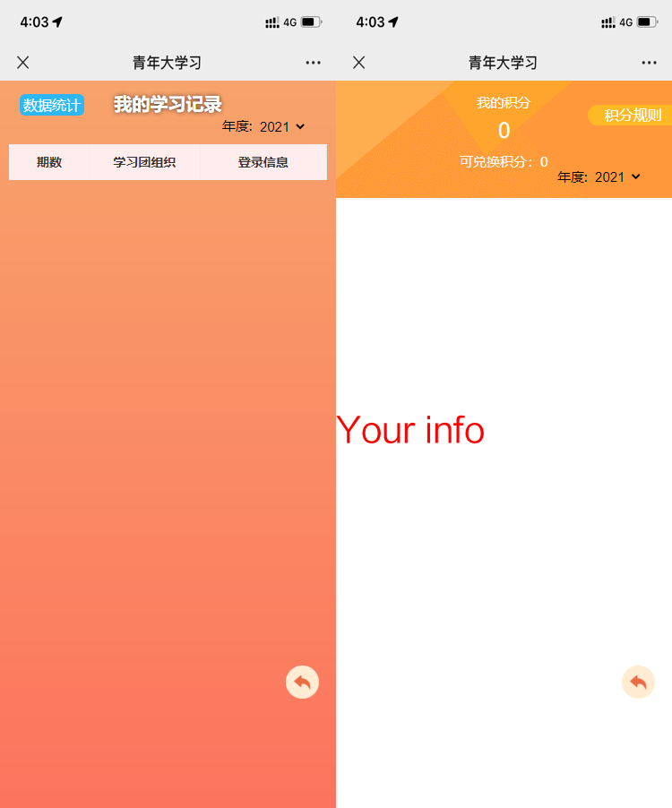
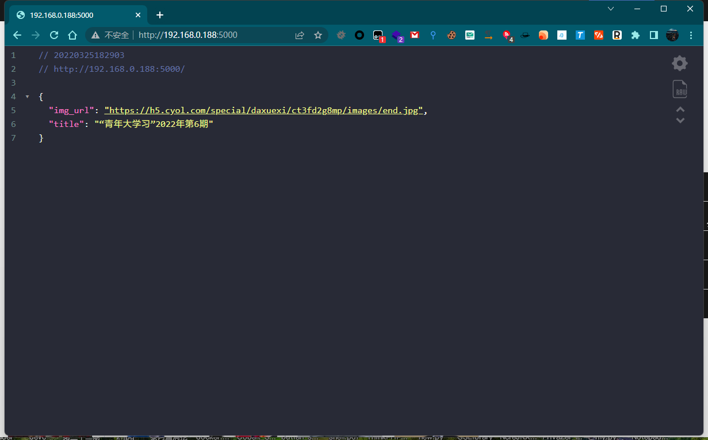

# 青年大学习自动化观看任务&截图

<div align=center></div>

	                                                             	                                            	

---

🤖 使用 `go-CQHttp`QQ机器人做推送

> 机器人项目地址
>
> [https://github.com/Mrs4s/go-cqhttp](https://github.com/Mrs4s/go-cqhttp)

🚀由于青年大学习网站屏蔽了云服务的 `ip`，所以在服务器上运行时需要使用代理，代理使用 `proxy_pool`代理池

> proxy\_pool代理项目地址
>
> [https://github.com/jhao104/proxy_pool](https://github.com/jhao104/proxy_pool)

---

### 使用

> - **使用前请阅读[Notice](#notice)**
>
> 以下操作基于 `linux`  以下操作基于 `linux`  以下操作基于 `linux`
>
>> arm版本在分支[`arm64`](https://github.com/captain686/Youth-Learning/tree/arm64)
>>
>> - arm版本不支持云端暂时只支持本地，所以arm版本不需要代理池
>>
>
> 向机器人QQ发送关键字即可获取截图
>
> 周一下午1点后会自动完成本次观看任务
>
> 访问 `http://你的ip:6106/`或 `http://你的ip:6106/img/`即可获取视频完成图片链接或截图
>
> 机器人获取截图样式
> 

---

### 配置

> 1. 抓取本人的青年大学习 `openid`值
>
>> 🍎IOS用户可使用Stream进行抓取
>>
>>> 1. 在设置里设置 `HTTPS`抓包
>>> 2. 设置抓包模式为白名单模式
>>> 3. 添加抓包域名 `*.youth54.cn`
>>> 4. 开启抓包访问青年大学习
>>> 5. 筛选抓包历史中的 `POST`请求可以找到 `openid`
>>>
>>
>> 😊 安卓系统可以使用 `HttpCanary`进行抓包（可能需要root）
>>
>>> 1. 在主界面点击加号选择微信
>>> 2. 开启抓包访问青年大学习
>>> 3. 在抓包历史中搜索youth54.cn，找到 `POST`请求可以找到 `openid`
>>>
>>> 你也可以选择使用电脑微信抓包
>>>
>>> 具体细节 `百度谷歌`
>>>
>>
>
> 1. 关于 `config.py`
>
>> `info` –> 你需要在图片上添加的水印信息
>>
>> `openid` –>你抓取到的 `openid`
>>
>> `proxyPool_url`  –>代理池地址，无需修改
>>
>> `Keyword` –>机器人触发关键字
>>
>
> 1. 配置机器人
>
>> 配置 `dxx/qbot/config.yml`文件
>>
>> `uin`:  # QQ账号
>>
>> `password`  # QQ密码
>>

### 搭建

🐳安装 `docker`以及 `docker-compose`

> `docker`换源自行搜索

```bash
git clone https://github.com/captain686/young-study.git
cd young-study
git clone https://github.com/jhao104/proxy_pool.git
mv proxy.yml -f proxy_pool/docker-compose.yml
cd proxy_pool && docker-compose up -d
cd ../ && docker-compose up -d
```

### 查看docker容器运行结果

```bash
docker ps
```

### 全部正常运行后进入青年大学习的主环境

```bash
docker exec -it $(docker ps|grep qndxx|awk '{print $1}') /bin/bash
```

### 配置机器人

> 注意：`qbot`文件夹中已经附带 `go-CQHttp`二进制文件，如想使用其他版本请在自行下载，并将 `go-CQHttp`二进制文件放置在 `dxx/qbot`目录下即可

```bash
cd qbot && chmod 777 go-cqhttp
```

```bash
./go-cqhttp
```

> `bash go-cqhttp`命令为启动机器人命令，关闭窗口时机器人会退出，可以使用进程守护执行程序，命令如下

```bash
nohup ./go-cqhttp > /home/dxx/DxxLog/cqhttp.log 2>&1 &
```

> 查看 `cqhttp.log`文件看机器人需不需要登陆验证

```bash
cat cqhttp.log
```

> 如果提示扫码登陆可将本目录下的 `png`文件下载到本地扫码登陆

### 关于视频最后截图

如果你只需要视频最后截图那你并不需要配置机器人

你只需要在微信里面访问

`http://你的ip:6106/`或 `http://你的ip:6106/img/`即可

> 😃`http://你的ip:6106/` 返回图片链接;
>
> 
>
> 🙈`http://你的ip:6106/img/`
> 返回图片
> 

## Update

### 2023-03-07

> 添加 `go-cqhttp`更新脚本，使用 `docker exec -it $(docker ps|grep qndxx|awk '{print $1}') /bin/bash `进入容器自动检测机器人最新版本

### 2020-03-25

> 优化了观看结尾截图页面样式，如图，本次更新提供两个版本模板，详细配置请看 `config.py`
>
> 默认采取 `img`模板，请根据自己需求更改
>
> 

### 😊 `To DO`

- [ ] 一个新的想法：使用 `github Actions`来完成整套流程，你只需要 `fork`本仓库然后再配置个人信息即可使用，截图通过邮箱推送，摆脱没有服务器的限制

### 👼 bug请提issues
